\begin{titlepage}
\centering

\includegraphics{ensai_logo_1.png}\\
\vspace{1.0cm}

{\LARGE\textsc{Rapport de projet traitement de données de Première Année}}\\
\vspace{0.5cm}
{\large Élèves 1A}

\vspace{2.5cm}

\rule{\textwidth}{0.5mm}\\
\vspace{0.8cm}
{\huge\bfseries A REMPLIR}\\
\vspace{0.8cm}
\rule{\textwidth}{0.5mm}\\

\vspace{2.5cm}

\begin{flushleft}
\emph{Étudiants :}\\
Groupe à préciser\\
Ilan GUEDJ\\
Jules FRULLI\\
Thomas ETIENNE\\
Alexandre FRATTER-BARDY\\
\end{flushleft}

\begin{flushright}
\emph{Responsable :}\\
Johann FAOUZI\\
\vspace{1.0cm}
\emph{Encadrant :}\\
Clément VALOT\\
\end{flushright}

\vfill 
\begin{center}
École nationale de la statistique et de l’analyse de l’information\\
2025--2026
\end{center}
\end{titlepage}

\setlength{\parindent}{20pt}

\color{black}
\tableofcontents
\thispagestyle{empty}

# Introduction {.unnumbered}

\pagenumbering{arabic}

Suite au succès des Jeux Olympiques et Paralympiques de Paris 2024, la gestion et l'analyse des données sportives sont devenues des enjeux stratégiques majeurs. C'est dans ce contexte stimulant que le Ministère des Sports, de la Jeunesse et de la Vie Associative souhaite développer une nouvelle application dédiée à la gestion centralisée des résultats de compétitions sportives. Cependant, l'histoire récente des grands projets informatiques de l'État est marquée par des échecs très coûteux (tels que les logiciels Scribe ou les systèmes de paie de l'Éducation nationale). Par conséquent, les attentes en matière de fiabilité, de conception et de résultats pour cette nouvelle application sont exceptionnellement élevées.

L'objectif principal est de concevoir et de développer une application robuste capable de modéliser l'écosystème sportif à travers la création d'entités telles que des matchs, des compétitions, des équipes ou encore des joueurs. L'application doit non seulement sauvegarder les caractéristiques pertinentes de ces acteurs, mais aussi offrir la possibilité d'intégrer dynamiquement les résultats de nouvelles compétitions afin de mettre à jour leurs statistiques de manière automatisée. Une des complexités majeures de ce cahier des charges réside dans l'exigence de modularité : l'application doit pouvoir fonctionner sur plusieurs jeux de données différents. Si certaines caractéristiques demeurent spécifiques à une discipline, le socle central des fonctionnalités se doit d'être universel et opérationnel indépendamment du sport traité.

Pour ce faire, nous devions manipuler divers jeux de données brutes. Tout l'enjeu a été de concevoir un système capable d'ingérer, de nettoyer et de structurer ces informations afin de les rendre exploitables par notre application, quel que soit le contexte sportif.

Afin de répondre efficacement à ces enjeux de modélisation et de flexibilité, nous avons raisonné en programmation orientée objet. Cette approche s'est révélée particulièrement pertinente, car elle permet de traduire fidèlement les concepts du monde réel en objets informatiques interagissant entre eux. Enfin, pour répondre à la contrainte stricte de maintenabilité imposée par le Ministère, une attention toute particulière a été accordée à l'architecture logicielle. L'application a été codée dans le strict respect des bonnes pratiques de programmation, garantissant ainsi un code propre, documenté et évolutif, prêt à être repris et enrichi par de futures équipes de développeurs sans risquer l'impasse technique.

# Modélisation et Diagrammes UML

## Diagramme d'état

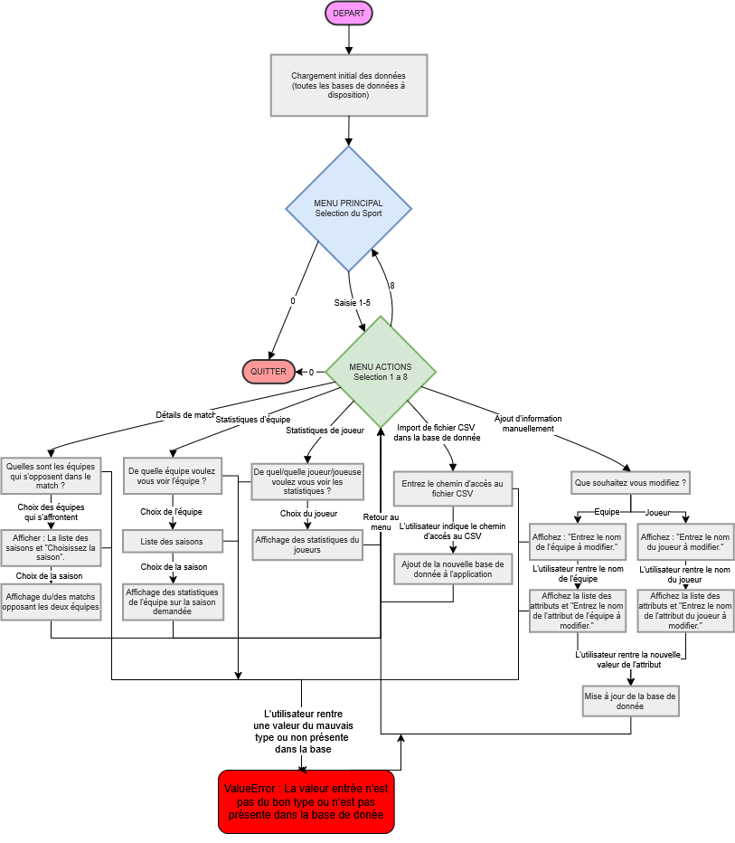{width="100%" fig-align="center"}
Pour éviter de surcharger le diagramme les fonctionnalités qui permettent de produire des graphiques n'ont pas été représentées dans le diagramme d'état.

## Diagramme de classe

{width="100%" fig-align="center"}
Le choix a été fait de ne pas mettre tous les loaders spécifiques des sports (seulement celui du foot qui est le même que les autres) pour éviter de surcharger la diagramme.

## Diagramme d'action

{width="100%" fig-align="center"}

# Architecture et choix techniques

## Les outils utilisés

Le langage de programmation utilisé lors de ce projet est *Python 3*. La bibliothèque Pandas est au cœur du traitement des fichiers CSV. Elle nous permet de réaliser toutes les tâches dont nous avons besoin pour répondre au cahier des charges : lecture, filtrage et sauvegarde des données. De plus, nous avons utilisé la bibliothèque *NumPy* pour optimiser les calculs des statistiques sur de grandes séries de données, par exemple pour le calcul de moyennes ou d’indicateurs clés sur les joueurs. Concernant la visualisation des données, la bibliothèque *Matplotlib* a été utilisée pour sa capacité à générer des graphiques, qu’ils soient complexes ou non, comme des histogrammes ou des heatmaps. Enfin, l’utilisation des modules natifs *os* et *sys* permettent de garantir la portabilité du code : gestion des chemins relatifs des fichiers de données et ce, peu importe l’ordinateur sur lequel le script est exécuté. 

## La programmation orientée objet

Lors de la réalisation de ce projet, nous avons fait face à un problème de données. En effet, ces données font référence à des sports différents. Ces données sont donc, par nature, hétérogènes. Nous avons par exemple des données sur le football, d’autres sur le tennis. Mais ces dernières sont séparées selon le genre de l’athlète. Par ailleurs, les fichiers CSV n’ont ni les mêmes colonnes, ni les mêmes unités de mesure d’un sport à l’autre. Ainsi, une approche avec de simples listes ou dictionnaires aurait créé un code peu lisible, rempli de conditions sur le sport choisi. Grâce à la programmation orientée objet (POO), nous avons créé une manière universelle de représenter nos sports, matchs et athlètes. Peu importe comment le joueur est décrit dans le fichier CSV, les loaders extraient la donnée et fabriquent un objet *Player* avec des attributs universels comme par exemple la taille ou le nom. Aussi,les responsabilités sont séparées,  le fichier *main.py* ne fait que gérer le menu, les loaders ne font que traduire les CSV en objets et les différents services proposés ne font que générer des graphiques ou des statistiques à partir de ces objets. 

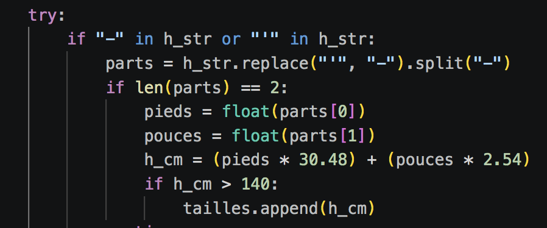{width="75%" fig-align="center"}
Cela représente un extrait de notre code portant sur le nettoyage des données. Nous suivons une logique de standardisation de la taille de l’objet *Player*, nous convertissons ainsi les données impériales (pieds-pouces) en système métrique (cm).

## Les choix d’utilisations

Nous avons fait le choix d’utiliser Pandas et non le module CSV natif. En effet, Pandas permet de gérer facilement les données textuelles incomplètes. Pandas permet également de pouvoir filtrer les données de manière plus efficace que si nous n’avions pas utilisé cette bibliothèque. Par exemple, dans notre classe *DataUpdater*, pour trouver un joueur quand on ne sait pas si la colonne s’appelle *fistr_name* ou *player_name*, Pandas fusionne virtuellement les colonnes des noms et applique un filtre de recherche.

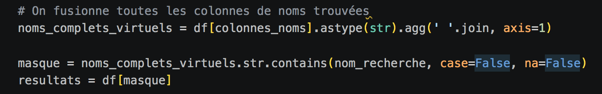{width="85%" fig-align="center"}
Pour répondre au cahier des charges, nous avons également utilisé la bibliothèque Matplotlib qui nous permet de réaliser des graphiques complets comme par exemple l’analyse de la taille des joueurs avec le pourcentage de victoires. Pour représenter la corrélation entre ces deux variables, nous avons utilisé la fonction *plt.hexbin()*. En effet, quand on croise deux variables comme la taille et le pourcentage de victoires pour des milliers d’individus, un graphique classique crée un nuage de points illisible. Donc cette fonction regroupe les joueurs par alvéoles et utilise la couleur pour montrer la concentration des individus dans un certaine zone. Cela offre une lecture plus fluide.

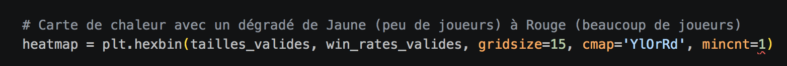{width="85%" fig-align="center"}
La mise à jour des données est isolée dans la classe *DataUpdater* car dans le cadre d’un outil utilisé par plusieurs acteurs, modifier les données en mémoire vive ne sert à rien si ce n’est pas sauvegardé. Ainsi, cette classe garantit que toute modification des données ou tout ajout de nouvelles données est réécrite de manière sécurisée et que les Loaders sont rechargés par la suite pour que l’application soit toujours à jour.

# Implémentation de la programmation orientée objet (POO)

Afin de gérer la diversité de nos données sportives et d'éviter un code difficile à maintenir, notre application repose sur une architecture logicielle modulaire. Nous avons divisé notre code en trois grandes familles de classes, respectant ainsi le principe de responsabilité unique : les modèles pour encapsuler la donnée, les loaders pour extraire et nettoyer, et les services pour traiter et analyser.

## Les classes modèles

Nous avons créé des classes spécifiques comme *Player*, *Team* et *Sport* qui agissent comme des conteneurs de données. Au lieu de manipuler directement des lignes de DataFrames ou des dictionnaires tout au long du code, chaque élément pertinent de nos fichiers CSV est transformé en un objet. L'objectif principal de cette démarche est la standardisation et la sécurité des données.
Par exemple, qu'un athlète provienne du fichier *atp_players_2024.csv* (tennis) ou *player.csv* (football), il devient un objet *Player* avec des attributs stricts et communs comme *prenom_nom*, *taille*, ou *genre*. Cette encapsulation garantit que le reste du programme n'a pas à se soucier des noms de colonnes originaux du CSV. Si une clé de dictionnaire vient à changer dans les données brutes, l'erreur ne se propagera pas dans toute l'application : la donnée est verrouillée et uniformisée au sein de l'objet. Cela permet à l'application de traiter n'importe quel sport de manière universelle.

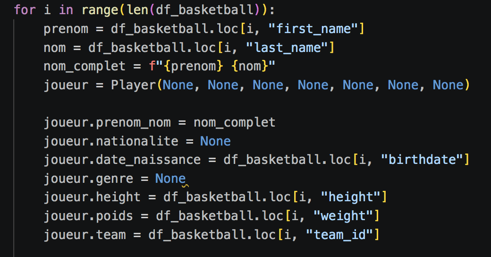{width="75%" fig-align="center"}

## Les classes Loaders

Pour protéger la logique de notre application des incohérences souvent présentes dans les jeux de données bruts, nous avons isolé la lecture des fichiers. La mission des classes  *MatchLoader*, *PlayerLoader* et *TeamLoader* est d'ouvrir les fichiers CSV, de gérer les valeurs manquantes via des blocs *try/except*, de convertir les types de variables (par exemple, transformer une chaîne de caractères en entier) et de fabriquer les objets finaux.
L'intérêt de cette approche est que chaque sport possède son propre comportement lors du chargement, sans impacter le programme principal. Par exemple, le loader du tennis gère la séparation des données en deux fichiers distincts (ATP pour les hommes et WTA pour les femmes). Le loader va lire ces deux fichiers séparément, leur ajouter une colonne *genre* pour garder la trace de la catégorie, puis utiliser *Pandas* pour les concaténer. Il renvoie ainsi une liste unique et complète de joueurs de tennis prête à être analysée.

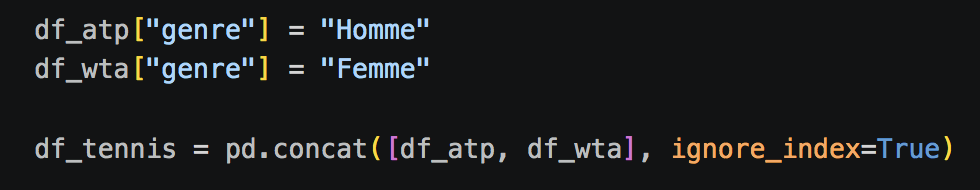{width="75%" fig-align="center"}

## Les classes services

Les services sont les classes qui effectuent les calculs complexes ou génèrent les affichages, sans stocker la donnée de manière permanente. Nous avons par exemple la classe AnalysePhysiologique, qui reçoit la liste des objets Player et s'occupe de toute la visualisation (génération des histogrammes et des heatmaps). Le fait de l'isoler dans une classe évite de surcharger le fichier principal **main.py** avec de multiples paramétrages Matplotlib et permet de réutiliser ces graphiques facilement.
De la même manière, d'autres classes de services gèrent la logique métier de l'application. La classe ChampionshipPointsCalculator s'occupe du calcul des points de victoires ou de défaites. Puisque les règles de calcul diffèrent selon les sports, cette classe centralise cette complexité : le programme principal se contente d'appeler une méthode unique, et le service applique la bonne formule. Enfin, la classe DataUpdater gère l'aspect persistance des données. Elle isole les opérations d'écriture afin de s'assurer que toute modification manuelle ou importation de nouvelle compétition n'écrase pas accidentellement nos historiques.

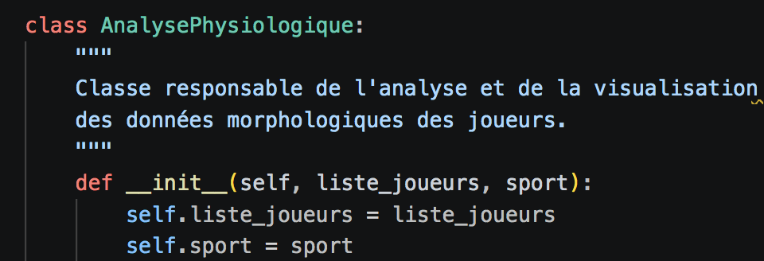{width="75%" fig-align="center"}

## Les avantages de cette architecure logicielle

Cette architecture nous a demandé un effort de modélisation et de conception au départ, mais elle apporte des bénéfices majeurs pour le projet.
Premièrement, la maintenabilité : le fichier principal *main.py* se contente d'afficher les menus et d'appeler des méthodes aux noms explicites, agissant uniquement comme un chef d'orchestre. En cas de bug lors d'un calcul, nous savons exactement dans quelle classe de service chercher, sans avoir à parcourir les lignes de code d'interface.
Deuxièmement, l'application est évolutive. Si nous souhaitons ajouter un nouveau sport possédant ses propres règles d'importation, comme le rugby, il n'est pas nécessaire de modifier le système de menus, les algorithmes de calcul ou les générateurs de graphiques. Il suffira d'ajouter les fichiers CSV correspondants et de créer une simple classe RugbyLoader. Le reste de l'application s'adaptera automatiquement pour traiter ces nouvelles entités.

#  Analyse des bases de données et traitements

## Présentation globale des données

Notre application traite des données issues de cinq sports différents : le football, le tennis, le basketball, le volleyball et League of Legends. D’autres bases de données concernant d’autres sports ont été données mais nous avons fait le choix de ne travailler qu’à partir de ces cinq premiers sports. Les données sont stockées au format CSV. Étant donné que ces jeux de données proviennent de sources distinctes, ils présentent une forte hétérogénéité. Les noms des colonnes diffèrent selon les sports, par exemple *first_name* et *last_name* pour le basket, contre *name_first* et *name_last* pour le tennis, tout comme les unités de mesure utilisées. Pour illustrer notre méthode de traitement, nous détaillerons ici l'analyse et le nettoyage du jeu de données du Basketball. 

## Analyse détaillée d'un jeu de données : le cas du Basketball

### Structure et types de variables

Le fichier *player.csv* du Basketball recense les athlètes professionnels. Chaque ligne représente un joueur unique. Parmi les variables brutes à notre disposition, nous exploitons principalement : les variables textuelles telles que  *first_name*, *last_name*, *team_name* et les variables numériques stockées sous format texte telles que *height* (taille) et *weight* (poids).

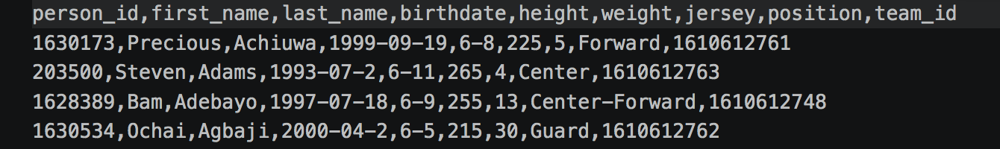{width="75%" fig-align="center"}

### Nettoyage et gestion des valeurs manquantes

Un jeu de données brut contient souvent des valeurs aberrantes ou manquantes. Lors de la phase de chargement effectuée par notre classe *BasketballPlayerLoader*, nous appliquons un nettoyage systématique. Nous utilisons les fonctionnalités de la bibliothèque Pandas pour filtrer ces données (par exemple via .dropna()) ou nous les gérons au niveau de l'extraction par des blocs *try/except*. Si un joueur ne possède ni taille ni poids valides dans le fichier source, une valeur par défaut de 0 ou None lui est attribuée temporairement, afin de ne pas faire planter les calculs statistiques globaux ou de l'exclure purement et simplement de l'affichage.

### Transformation spécifique : conversion des mesures impériales

La particularité majeure de ce jeu de données est son système de mesure américain. La taille y est renseignée en pieds et pouces sous forme de chaîne de caractères (ex: "6-8" pour 6 pieds et 8 pouces). Pour que ces données puissent être comparées avec celles du football ou du volleyball, il fallait les convertir dans le système métrique.
Nous avons donc implémenté un algorithme d'extraction et de conversion. Pour la taille, le code divise la chaîne de caractères grâce à la méthode .split("-"). Il multiplie ensuite la première valeur représentant les pieds par 30,48 et la seconde représentant les pouces par 2,54, avant d'additionner les deux pour obtenir la taille exacte en centimètres.

## L'harmonisation 

Ce travail de nettoyage et de transformation a été adapté à la spécificité de chaque jeu de données. À titre d'exemple, pour la base de données du Tennis, les données étaient scindées en deux fichiers distincts (ATP pour les hommes, WTA pour les femmes). Le traitement de ce jeu de données a nécessité l'ajout d'une colonne de genre et la concaténation des deux fichiers via Pandas avant de procéder à l'extraction. Ces traitements spécifiques garantissent que, in fine, toutes les données convergent vers un modèle unique et exploitable par notre application.

# Présentation des résultats

Le développement de notre architecture orientée objet, couplé à l'utilisation des bibliothèques Pandas et Matplotlib, a permis d'aboutir à une application fonctionnelle et dynamique. L'interface reflète directement la modularité de notre code sous-jacent. Cette section présente visuellement les fonctionnalités implémentées, qui démontre ainsi la conformité de notre rendu avec le cahier des charges initial.

## L'interface utilisateur

L'application repose sur une interface en ligne de commande structurée autour d'une boucle d'exécution continue. À l'ouverture, l'utilisateur est invité à sélectionner le sport qu'il souhaite analyser parmi les cinq disciplines chargées en mémoire. L'application intègre des mécanismes de sécurité pour fluidifier l'expérience : si un jeu de données est manquant ou corrompu pour un sport précis, le programme ne s'interrompt pas. Il informe l'utilisateur de l'indisponibilité des données et l'invite à choisir une autre option. Une fois le sport sélectionné, un menu d'actions contextuel s'affiche, offrant une arborescence claire entre les requêtes statistiques simples, les visualisations graphiques avancées et le module d'administration des données.

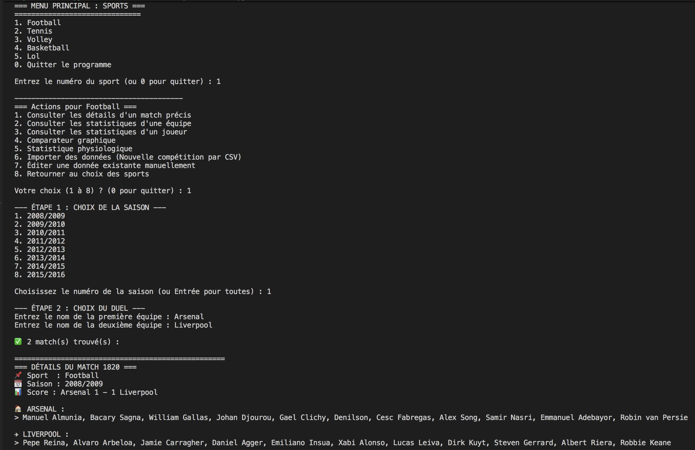{width="75%" fig-align="center"}

## Consultation des statistiques

La première fonctionnalité majeure de l'application est sa capacité d'interrogation ciblée. En saisissant le nom d'une entité (un joueur ou une équipe), le programme utilise ses algorithmes sur l'historique des matchs. Afin d'offrir une précision maximale, l'utilisateur peut filtrer sa requête sur une saison spécifique ou demander un bilan global sur l'ensemble de la carrière. L'application s'adapte dynamiquement aux règles inhérentes à chaque discipline sportive : elle calcule et affiche le nombre de matchs nuls si la requête concerne le football, mais occulte automatiquement cette caractéristique pour des sports comme le tennis ou League of Legends, calculant ainsi un taux de victoire.

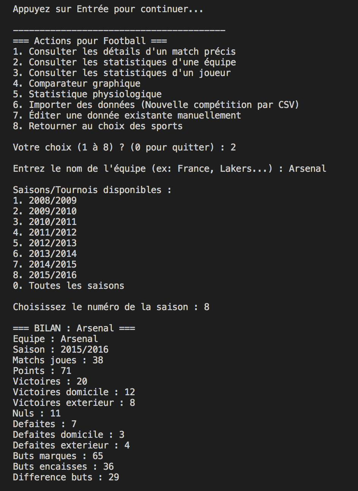{width="75%" fig-align="center"}

## Les comparateurs graphiques 

Pour dépasser les limites de la simple lecture de données textuelles, l'application intègre un outil d'analyse comparative visuelle. Ce comparateur permet de mettre en opposition directe deux joueurs ou deux équipes. Une fois les cibles et la temporalité (saison spécifique ou historique complet) sélectionnées par l'utilisateur, l'application sollicite Matplotlib pour générer des diagrammes en barres. Ces graphiques permettent de confronter instantanément les volumes de matchs joués et les taux de victoire.

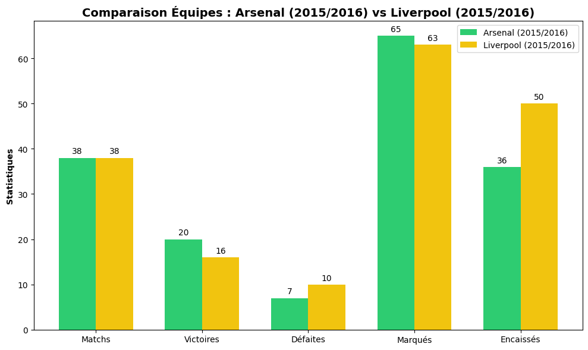{width="75%" fig-align="center"}

## Analyses physiologiques et data visualisation 

Notre classe *AnalysePhysiologique* propose des visualisations croisées. Un premier niveau de lecture prend la forme d'un histogramme des tailles, utile pour identifier le profil physique médian d'un sport donné.
Par ailleurs, nous avons également une méthode pour analyser la corrélation entre les caractéristiques physiques (taille) et les performances (pourcentage de victoire). Pour des bases de données volumineuses contenant des milliers de joueurs, un nuage de points classique aurait été illisible à cause de la superposition des données. Nous avons donc opté pour une carte de chaleur en nid d'abeille (fonction hexbin). Cette méthode regroupe les joueurs par alvéoles et utilise une échelle colorimétrique pour mettre en évidence les zones de chaleur physiologique où se concentrent les joueurs les plus victorieux.

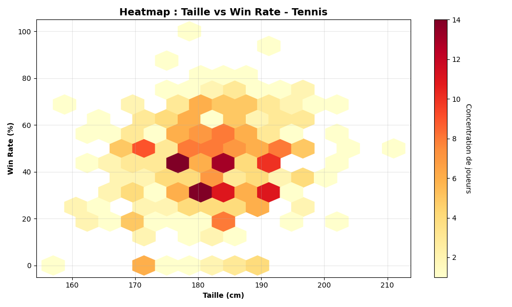{width="75%" fig-align="center"}

## Édition et mise à jour dynamique

L'application se distingue par sa dimension interactive et pérenne grâce à son module de gestion des données intégré. Elle permet non seulement d'importer de nouveaux fichiers de compétition, mais aussi d'éditer les données existantes pour corriger d'éventuelles anomalies.
Lorsqu'un utilisateur recherche une entité à modifier, l'algorithme utilise Pandas pour fusionner virtuellement les colonnes. Une fois la cellule ciblée et la nouvelle valeur saisie, la méthode *to_csv()*  réécrit physiquement le fichier sur le disque dur, garantissant la persistance de l'information. Immédiatement après la sauvegarde, l'application force les Loaders à rafraîchir les instances en mémoire vive. Ainsi, les modifications manuelles et les nouveaux matchs sont instantanément pris en compte dans les calculs et les graphiques suivants, sans que l'utilisateur n'ait besoin de redémarrer le programme

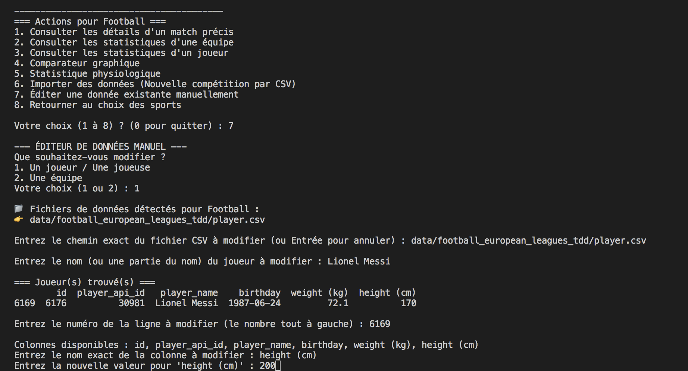{width="75%" fig-align="center"}

