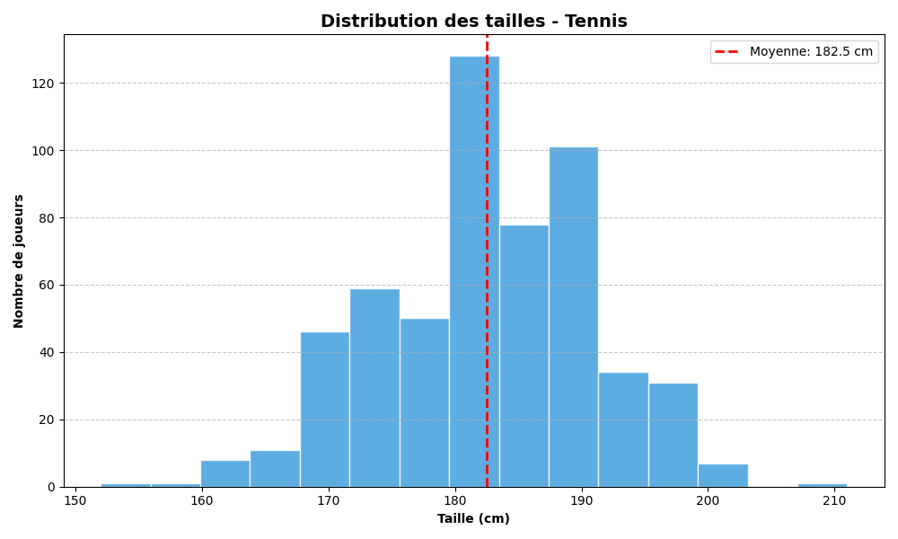

\begin{titlepage}
\centering

\includegraphics{ensai_logo_1.png}\\
\vspace{1.0cm}

{\LARGE\textsc{Rapport de projet traitement de données de Première Année}}\\
\vspace{0.5cm}
{\large Élèves 1A}

\vspace{2.5cm}

\rule{\textwidth}{0.5mm}\\
\vspace{0.8cm}
{\huge\bfseries A REMPLIR}\\
\vspace{0.8cm}
\rule{\textwidth}{0.5mm}\\

\vspace{2.5cm}

\begin{flushleft}
\emph{Étudiants :}\\
Groupe à préciser\\
Ilan GUEDJ\\
Jules FRULLI\\
Thomas ETIENNE\\
Alexandre FRATTER-BARDY\\
\end{flushleft}

\begin{flushright}
\emph{Responsable :}\\
Johann FAOUZI\\
\vspace{1.0cm}
\emph{Encadrant :}\\
Clément VALOT\\
\end{flushright}

\vfill 
\begin{center}
École nationale de la statistique et de l’analyse de l’information\\
2025--2026
\end{center}
\end{titlepage}

\setlength{\parindent}{20pt}

\color{black}
\tableofcontents
\thispagestyle{empty}

# Introduction {.unnumbered}

\pagenumbering{arabic}

Suite au succès des Jeux Olympiques et Paralympiques de Paris 2024, la gestion et l'analyse des données sportives sont devenues des enjeux stratégiques majeurs. C'est dans ce contexte stimulant que le Ministère des Sports, de la Jeunesse et de la Vie Associative souhaite développer une nouvelle application dédiée à la gestion centralisée des résultats de compétitions sportives. Cependant, l'histoire récente des grands projets informatiques de l'État est marquée par des échecs très coûteux (tels que les logiciels Scribe ou les systèmes de paie de l'Éducation nationale). Par conséquent, les attentes en matière de fiabilité, de conception et de résultats pour cette nouvelle application sont exceptionnellement élevées.

L'objectif principal est de concevoir et de développer une application robuste capable de modéliser l'écosystème sportif à travers la création d'entités telles que des matchs, des compétitions, des équipes ou encore des joueurs. L'application doit non seulement sauvegarder les caractéristiques pertinentes de ces acteurs, mais aussi offrir la possibilité d'intégrer dynamiquement les résultats de nouvelles compétitions afin de mettre à jour leurs statistiques de manière automatisée. Une des complexités majeures de ce cahier des charges réside dans l'exigence de modularité : l'application doit pouvoir fonctionner sur plusieurs jeux de données différents. Si certaines caractéristiques demeurent spécifiques à une discipline, le socle central des fonctionnalités se doit d'être universel et opérationnel indépendamment du sport traité.

Pour ce faire, nous devions manipuler divers jeux de données brutes. Tout l'enjeu a été de concevoir un système capable d'ingérer, de nettoyer et de structurer ces informations afin de les rendre exploitables par notre application, quel que soit le contexte sportif.

Afin de répondre efficacement à ces enjeux de modélisation et de flexibilité, nous avons raisonné en programmation orientée objet. Cette approche s'est révélée particulièrement pertinente, car elle permet de traduire fidèlement les concepts du monde réel en objets informatiques interagissant entre eux. Enfin, pour répondre à la contrainte stricte de maintenabilité imposée par le Ministère, une attention toute particulière a été accordée à l'architecture logicielle. L'application a été codée dans le strict respect des bonnes pratiques de programmation, garantissant ainsi un code propre, documenté et évolutif, prêt à être repris et enrichi par de futures équipes de développeurs sans risquer l'impasse technique.

{width="75%" fig-align="center"}
